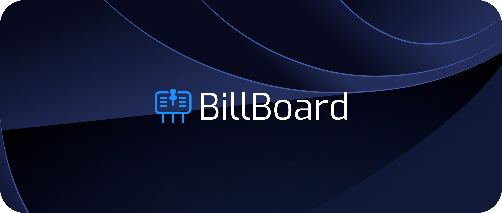

# 🚀 About

BillBoard is a comprehensive platform designed to keep Canadians informed and engaged with their government. We provide Canadians real-time policy updates, a community forum for discussions, and a map to find representatives. We also have numerous features to help you learn and engage, such as our AI chatbot Billy!

We built BillBoard at [Hack the Change 2024](https://hackthechangeyyc.ca/).

# 🛠️ Setup

1. Clone the repository using one of the following methods. 

    HTTPS:
     ```bash
     git clone https://github.com/farazht/BillBoard.git
     ```

   SSH (requires SSH keys set up on your GitHub account):
     ```bash
     git clone git@github.com:farazht/BillBoard.git
     ```

   GitHub CLI (requires installation):
     ```bash
     gh repo clone farazht/BillBoard
     ```

2. Install necessary packages.

    ```bash
    npm install
    ```

3. Run development server. *Note: there are more custom dev commands available in `package.json`.*

    ```bash
    npm run dev
    ```

# 📖 Attribution

- **Frontend:** Next.js, React, Typescript, TailwindCSS
- **Backend:** Next.js, Supabase, PostgreSQL
- **Map Integration:** Leaflet.js
- **LLM Integration:** OpenAI API
- **Special thanks:** react-icons, tiptap, radix-ui, Mapshaper.org

By Alex, Alejandro, Faraz, Jun, Joseph. 